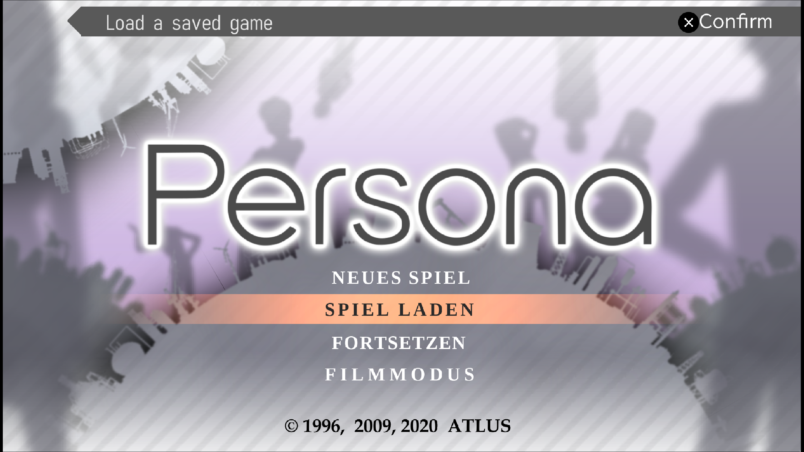
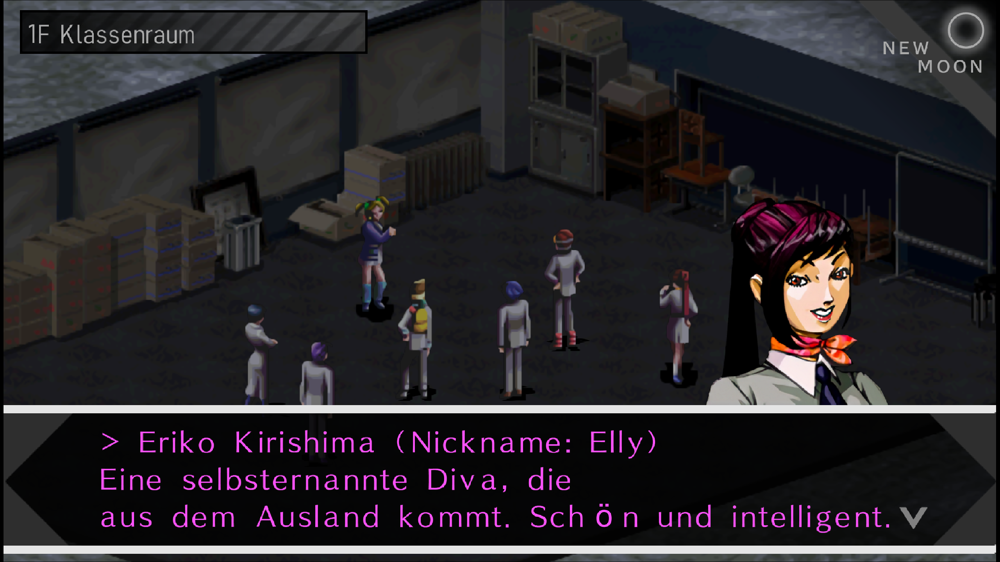
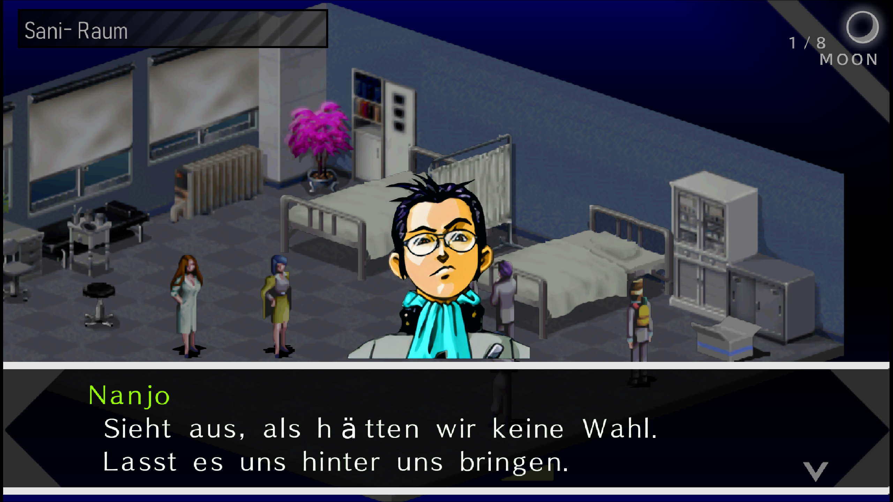
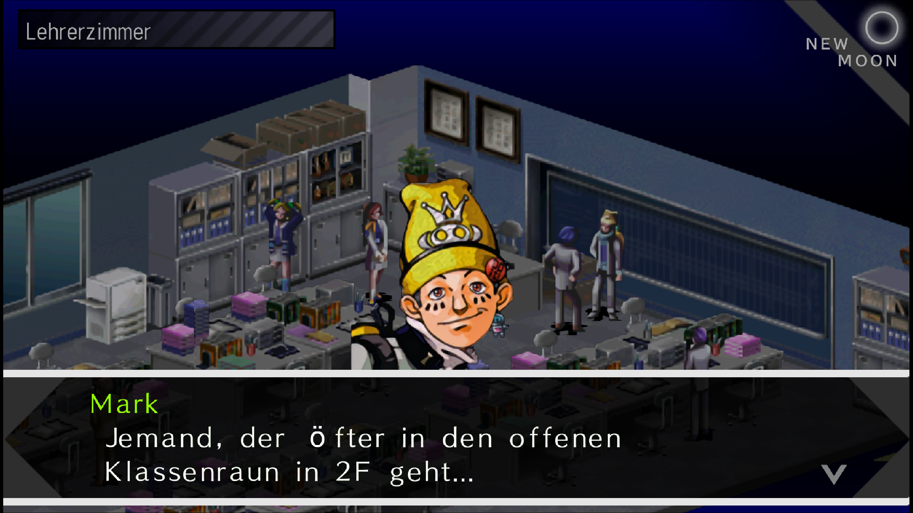
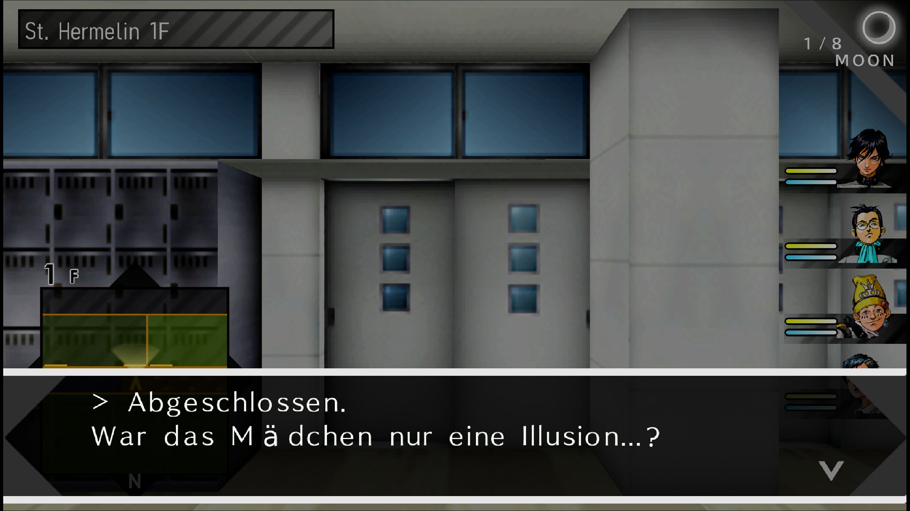
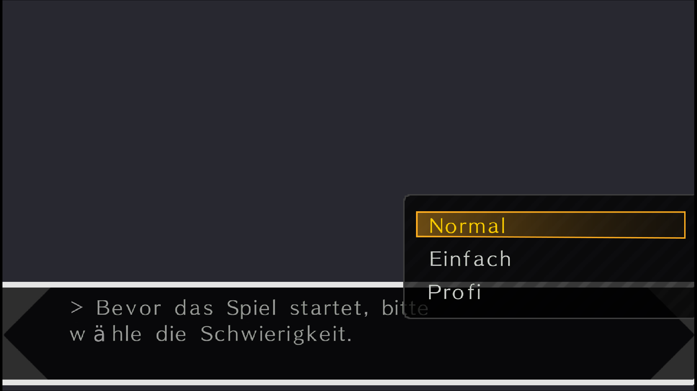

# Revelations: Persona DE


_**HEAVILY WIP**_
---

Unofficial German translation of Revelations: Persona for the PSP.

<table>
  <tr>
    <td></td>
    <td></td>
  </tr>
  <tr>
    <td></td>
    <td></td>
  </tr>
  <tr>
    <td></td>
    <td></td>
  </tr>
</table>

This repo is the translation. German `.TXT` files, notes, and the scripts that copy those files into a local tool. The game itself does not belong here.

Persona is Atlus / SEGA. This project is not affiliated with them. You need your own dump. Do not open a pull request that adds an ISO, `EBOOT.BIN`, or anything that was not modified.

## Important

- Still heavily WIP. Only the first school scenes are translated yet.
- I made the [`HD-UI Mod`](https://gamebanana.com/mods/309876) now as a requirement to make umlauts and texture translation possible
- Just paste the contents of `TEXTURES/` into `PSP/TEXTURES/` of your emulator. I made changes to the font atlas and some textures like menu stuff already.

## Future

- This translation is planned to be complete in the future. I still need to figure out where some text live, extract it, translate it and put it pack into the iso
- The plan is to make it easy as possible to use. Plan is to provide a patched ISO (somehow) and the translated Textures

## Requirements

- [`PersonaFlowReader`](https://github.com/TopCape/PersonaFlowReader)
- [`HD-UI Mod`](https://gamebanana.com/mods/309876)
- p7zip
- python3
- java
- An original Persona 1 PSP ISO and a decrypted `EBOOT.BIN`

## How you work

### Info

I now added the important `eboot_options.py` so now you can patch your own dump by yourself with my toolchain.

PersonaFlowReader is still needed. The jar does the encode/archive. You just don't sit in its menu every day. `build-pack.sh` starts it for you. First time you still extract and decode in the menu (see `tools/README.md`). After that, leave it alone.

There are two kinds of text. They use different commands.

### Event text (rooms, NPC talk, cutscenes)

These are `script/E0/*.TXT` (later E1-E4). One file is one room/event.

1. Edit the file in `script/E0/`. Not the copy inside PersonaFlowReader.
2. Build and put it into the test ISO:

   ```bash
   ./tools/build-pack.sh 0
   ```

   `0` is pack E0. Use `1` for E1, and so on.

3. Boot `P1_TEST_ISO` in PPSSPP. Walk the room you changed.
4. If it works, commit the `.TXT` file. Nothing else.

That is the whole event pipeline. `build-pack.sh` copies the German text, puts untouched rooms back to vanilla, encodes only the German scenes (via the PFR jar), keeps every room at its original size, packs `E0.BIN`, and writes it into the test ISO.

Do **not** encode the whole `extracted/E0/` folder in the PersonaFlowReader menu. That rewrites rooms you never translated, later rooms slide, and the game loading-loops.<https://gamebanana.com/mods/309876>

### Menus / UI (Yes/No, room names, battle text, items)

These are `script/eboot/*.txt`. They live in the decrypted EBOOT, not in E0.BIN.

1. Edit the file in `script/eboot/`. Leave every `=====` header and every `(*TAG*)` alone. A line longer than `BYTES` is refused.
2. Patch:

   ```bash
   ./tools/patch-iso.sh eboot
   ```

3. Boot the test ISO. Commit the `.txt` if it looks right.

Room names (`LocationUI.txt`) use `(*PAD,N*)` for leading spaces. If the banner shows only the end of the name (`nraum` instead of `Klassenraum`), lower `N`.

### Dungeon maps (locked doors, levers, riddles)

These are `script/dng/*.txt`. They live in `pack/dng/dXX/dXX.bin` on the ISO, not in the EBOOT.

1. Edit the file in `script/dng/`. Same header/`(*TAG*)`/`BYTES` rules as eboot.
2. Patch:

   ```bash
   ./tools/patch-iso.sh dng
   ```

`d00.txt` is St. Hermelin. `extract-dng-text.sh` writes the dumps the first time.

How a dialogue line should look is in `docs/style.md`. Names in `docs/glossary.md`. What the packs are is in `script/README.md`.

## First time

```bash
cp config.example.env config.env
./tools/check-setup.sh
```

OK means it is there. FAIL means you cannot work yet. WARN is optional stuff like a test ISO that does not exist until the first patch.

Set three paths in `config.env`:

- `P1_ISO` - your original ISO
- `P1_TEST_ISO` - where a patched copy should be written
- `PFR_ROOT` - the PersonaFlowReader folder that contains `extracted/`, `output/`, and `*.jar`

You also need a decrypted `EBOOT.BIN` in `$PFR_ROOT/OG/`, the `EX.BIN` packs in the same folder, and PersonaFlowReader built once. The jar has to stay there. `build-pack.sh` will not work without it. How to dump and build is in `tools/README.md`.

## Layout

```
script/          German event text, grouped the same way the game packs it
                 script/eboot/ is EBOOT dumps (menus, difficulty, battle UI, ...)
docs/            glossary, style, how far we are
tools/           copy text to/from PersonaFlowReader, patch your ISO
config.example.env
```

PersonaFlowReader and the ISO should live next to this repo, not inside it. `config.env` points at them.

## What is in git

| In the repo       | Not in the repo                            |
| ----------------- | ------------------------------------------ |
| `script/**/*.TXT` | ISOs                                       |
| `script/eboot/`   | decrypted `EBOOT.BIN` (keep that in `OG/`) |
| `docs/`           | `E0.BIN`–`E4.BIN`, `EBOOT.BIN`             |
| `tools/`          | `.EVS`, audio                              |
| this README       | PersonaFlowReader itself                   |

`git status` should never show an `.iso` or a `.BIN`. If it does, stop and check `.gitignore`.
